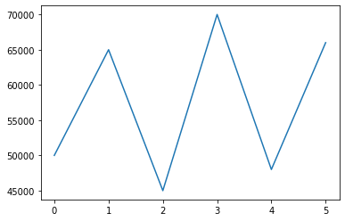
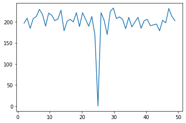

# Complex Indexing using Numpy
+ [Overview](#Overview)
+ [Indexing using arrays of indices](#Indexing-using-arrays-of-indices)
+ [Fancy Indexing](#Fancy-Indexing)
+ [Indexing with Boolean Arrays](#Indexing-with-Boolean-Arrays)
+ [Arrays with Structured Data](#Indexing-with-Structured-Data)
+ [Broadcasting](#Broadcasting)
+ [Automatic Reshaping](#Automatic-Reshaping)
+ [Stacking Arrays](#Stacking-Array)
+ [Histograms](#Histograms)
+ [Miscellaneous Operations](#Miscellaneous-Operations)

## Overview
+ Complex indexing operations to access specific elements in an array
+ Working with boolean array generated with conditions
+ Introducing array with structured data a precursor to data frames
+ Working with mismatched array using broadcasting rules

## Indexing using arrays of indices


```python
import numpy as np
a = np.arange(12)**2
print(a)
```

    [  0   1   4   9  16  25  36  49  64  81 100 121]


#### Access value by index


```python
a[2],a[5],a[9]
```


    (4, 25, 81)


#### Access values by array of indices


```python
ind_1 = [2,5,9]
a[ind_1]
```


    array([ 4, 25, 81])


#### Access values by Nd array indices


```python
ind_2 = np.array([[2,5],[7,9]])
a[ind_2]
```


    array([[ 4, 25],
           [49, 81]])


#### Access values by array of an array indices


```python
a = np.arange(12).reshape(3,4)
a
```


    array([[ 0,  1,  2,  3],
           [ 4,  5,  6,  7],
           [ 8,  9, 10, 11]])


```python
row = np.array([[0,0],[1,2]])
col = np.array([[0,1],[0,2]])
a[row,col]
```


    array([[ 0,  1],
           [ 4, 10]])


**Output Explain**
+ 0 = a[0][0]
+ 1 = a[0][1]
+ 4 = a[1][0]
+ 10 = a[2][2]


```python
a[row,col] = -1
print(a)
```

    [[-1 -1  2  3]
     [-1  5  6  7]
     [ 8  9 -1 11]]


## Fancy Indexing


```python
import numpy as np
import pandas as pd
import matplotlib.pyplot as plt
```


```python
salary = pd.read_csv('data/hrdata.csv')['Salary'].values
```


```python
print(salary)
```

    [50000. 65000. 45000. 70000. 48000. 66000.]


```python
type(salary)
```


    numpy.ndarray


```python
salary.shape
```


    (6,)


```python
plt.plot(salary)
plt.show()
```





```python
np.median(salary)
```


    57500.0


```python
np.mean(salary)
```


    57333.333333333336


```python
 #exclude nan
salary = salary[~np.isnan(salary)]
```

#### Sort


```python
np.sort(salary)
```


    array([45000., 48000., 50000., 65000., 66000., 70000.])


##### Two lowest salary


```python
np.sort(salary)[0:2]
```


    array([45000., 48000.])


##### Two highest salary


```python
np.sort(salary)[-2:]
```


    array([66000., 70000.])


#### Count


```python
np.count_nonzero(salary)
```


    6


##### Salary > 50000


```python
np.count_nonzero(salary[salary>50000])
```


    3


##### Salary < 70000


```python
np.count_nonzero(salary[salary<70000])
```


    5


##### Salary > 50000 AND Salary < 68000


```python
np.count_nonzero((salary>50000) & (salary<68000))
```


    2


## Indexing with Boolean Arrays


```python
a = np.arange(16).reshape(4,4)
a
```


    array([[ 0,  1,  2,  3],
           [ 4,  5,  6,  7],
           [ 8,  9, 10, 11],
           [12, 13, 14, 15]])


```python
bool_index = a > 10
bool_index
```


    array([[False, False, False, False],
           [False, False, False, False],
           [False, False, False,  True],
           [ True,  True,  True,  True]])


```python
a[bool_index]
```


    array([11, 12, 13, 14, 15])


```python
a[a>10]
```


    array([11, 12, 13, 14, 15])


```python
np.count_nonzero(a>10)
```


    5


```python
# count 'True' in boolen index
np.sum(a>10)
```


    5


```python
# 1st row - 0 element with value>10
# 2nd row - 0 element with value>10
# 3rd row - 1 element with value>10
# th row - 2 element with value>10
np.sum(a>10,axis=1)
```


    array([0, 0, 1, 4])


```python
#In array is there any element >10
np.any(a>10)
```


    True


```python
#In array is there any element<0
np.any(a<0)
```


    False


```python
#In row is there any element>10
np.any(a>10,axis=1)
```


    array([False, False,  True,  True])


```python
# Are all the elements > 10
np.all(a>10)
```


    False


```python
# Are all the elements < 20
np.all(a<20)
```


    True


```python
# Are all the elements in row > 10
np.all(a>10,axis=1)
```


    array([False, False, False,  True])


## Indexing with Structured Data


```python
hrdata = pd.read_csv('data/hrdata.csv')
ids = hrdata['Id'].values
name = hrdata['Name'].values
salary = hrdata['Salary'].values
print(ids)
print(name)
print(salary)
```

    [1 2 3 4 5 6]
    ['Graham Chapman' 'John Cleese' 'Eric Idle' 'Terry Jones' 'Terry Gilliam'
     'Michael Palin']
    [50000. 65000. 45000. 70000. 48000. 66000.]


```python
employee_data = np.zeros(6,dtype={'names':('id','name','salary'),
                                  'formats':('i4','U15','f8')})
print(employee_data)
```

    [(0, '', 0.) (0, '', 0.) (0, '', 0.) (0, '', 0.) (0, '', 0.) (0, '', 0.)]


```python
employee_data['id'] = ids
employee_data['name'] = name
employee_data['salary'] = salary
```


```python
print(employee_data)
```

    [(1, 'Graham Chapman', 50000.) (2, 'John Cleese', 65000.)
     (3, 'Eric Idle', 45000.) (4, 'Terry Jones', 70000.)
     (5, 'Terry Gilliam', 48000.) (6, 'Michael Palin', 66000.)]


```python
employee_data['name']
```


    array(['Graham Chapman', 'John Cleese', 'Eric Idle', 'Terry Jones',
           'Terry Gilliam', 'Michael Palin'], dtype='<U15')


```python
employee_data['id']
```


    array([1, 2, 3, 4, 5, 6], dtype=int32)


```python
#2nd employee
employee_data[1]
```


    (2, 'John Cleese', 65000.)


```python
#2nd employee name
employee_data[1]['name']
```


    'John Cleese'


```python
#last employee salary
employee_data[-1]['salary']
```


    66000.0


```python
employee_data[employee_data['salary']>50000]['name']
```


    array(['John Cleese', 'Terry Jones', 'Michael Palin'], dtype='<U15')


## Broadcasting

Broadcasting in Numpy means how Numpy treats arrays with different shapes during arithmatic operations. Subject to certain constraints, the small array is 'broadcast' across the large array so that they have compatible shapes.

### Broadcasting Scalars

Always broadcaste and independent of the other array in operation

#### Example 1
When we perform below operation, auto broadcaste 10 to perform operation.


```python
a1 = np.array([1,2,3,4,5])
a1 * 10
```


    array([10, 20, 30, 40, 50])


Here Numpy increases the size of an array in below way by making a copy of same element.


```python
a1 = np.array([1,2,3,4,5])
a2 = np.array([10,10,10,10,10])
a1 * a2
```


    array([10, 20, 30, 40, 50])


##### Example 2


```python
a1 = np.arange(12).reshape(3,4)
print(a1*10)
```

    [[  0  10  20  30]
     [ 40  50  60  70]
     [ 80  90 100 110]]


Here numpy broadcaste value in all dimension to perform operations.


```python
a1 = np.arange(12).reshape(3,4)
a2 = np.full((3, 4), 10)
print(a1*a2)
```

    [[  0  10  20  30]
     [ 40  50  60  70]
     [ 80  90 100 110]]


### Broadcasting Arrays

Only broadcaste if the shapes of the two array match.


```python
a1 = np.arange(12).reshape(3,4)
a2 = np.arange(3).reshape(3,1)
print(a1)
print(a2)
print(a1 * a2)
```

    [[ 0  1  2  3]
     [ 4  5  6  7]
     [ 8  9 10 11]]
    [[0]
     [1]
     [2]]
    [[ 0  0  0  0]
     [ 4  5  6  7]
     [16 18 20 22]]


Below operation cannot be performed.

###### Example 1

```python
a1 = np.arange(12).reshape(3,4)
a2 = np.arange(3).reshape(1,3)
print(a1)
print(a2)
print(a1 * a2)
```

###### Example 2

```python
a1 = np.arange(12).reshape(3,4)
a2 = np.arange(2).reshape(2,1)
print(a1)
print(a2)
print(a1 * a2)
```

###### Example 3

```python
a1 = np.arange(12).reshape(3,4)
a2 = np.arange(6).reshape(3,2)
print(a1)
print(a2)
print(a1 * a2)
```

## Automatic Reshaping


```python
a = np.arange(30)
print(a)
```

    [ 0  1  2  3  4  5  6  7  8  9 10 11 12 13 14 15 16 17 18 19 20 21 22 23
     24 25 26 27 28 29]


```python
# here -1 means we don't know size
a.shape = 2,-1,3
```


```python
print(a)
```

    [[[ 0  1  2]
      [ 3  4  5]
      [ 6  7  8]
      [ 9 10 11]
      [12 13 14]]
    
     [[15 16 17]
      [18 19 20]
      [21 22 23]
      [24 25 26]
      [27 28 29]]]


Here Numpy converts array in to 2 x 5 x 3 Array 


```python
a.shape
```


    (2, 5, 3)


```python
a.shape = 2,3,-1
print(a)
```

    [[[ 0  1  2  3  4]
      [ 5  6  7  8  9]
      [10 11 12 13 14]]
    
     [[15 16 17 18 19]
      [20 21 22 23 24]
      [25 26 27 28 29]]]


```python
a.shape
```


    (2, 3, 5)


## Stacking Array

### Concating arrays


```python
a = np.arange(0,4,1).reshape(2,2)
b = np.arange(4,8,1).reshape(2,2)
print('A =\n',a)
print('B =\n',b)
```

    A =
     [[0 1]
     [2 3]]
    B =
     [[4 5]
     [6 7]]


```python
# Joining two arrays in axis = 0
np.concatenate((a,b))
```


    array([[0, 1],
           [2, 3],
           [4, 5],
           [6, 7]])


```python
# Joining two arrays in axis = 1
np.concatenate((a,b),axis=1)
```


    array([[0, 1, 4, 5],
           [2, 3, 6, 7]])


### Stacking arrays


```python
a = np.array([1,2,3,4])
b = np.array([5,6,7,8])
```


```python
np.stack((a,b))
```


    array([[1, 2, 3, 4],
           [5, 6, 7, 8]])


```python
np.stack((a,b),axis = 1)
```


    array([[1, 5],
           [2, 6],
           [3, 7],
           [4, 8]])


```python
hrdata = pd.read_csv('data/hrdata.csv')
ids = hrdata['Id'].values
name = hrdata['Name'].values
salary = hrdata['Salary'].values
print(ids)
print(name)
print(salary)
```

    [1 2 3 4 5 6]
    ['Graham Chapman' 'John Cleese' 'Eric Idle' 'Terry Jones' 'Terry Gilliam'
     'Michael Palin']
    [50000. 65000. 45000. 70000. 48000. 66000.]


```python
s = np.stack((ids,name,salary))
print(s)
print(s.shape)
```

    [[1 2 3 4 5 6]
     ['Graham Chapman' 'John Cleese' 'Eric Idle' 'Terry Jones'
      'Terry Gilliam' 'Michael Palin']
     [50000.0 65000.0 45000.0 70000.0 48000.0 66000.0]]
    (3, 6)


```python
s = np.stack((ids,name,salary),axis=1)
print(s)
print(s.shape)
```

    [[1 'Graham Chapman' 50000.0]
     [2 'John Cleese' 65000.0]
     [3 'Eric Idle' 45000.0]
     [4 'Terry Jones' 70000.0]
     [5 'Terry Gilliam' 48000.0]
     [6 'Michael Palin' 66000.0]]
    (6, 3)


```python
s = np.vstack((ids,name,salary))
print(s)
print(s.shape)
```

    [[1 2 3 4 5 6]
     ['Graham Chapman' 'John Cleese' 'Eric Idle' 'Terry Jones'
      'Terry Gilliam' 'Michael Palin']
     [50000.0 65000.0 45000.0 70000.0 48000.0 66000.0]]
    (3, 6)


```python
s = np.hstack((ids,name,salary))
print(s)
print(s.shape)
```

    [1 2 3 4 5 6 'Graham Chapman' 'John Cleese' 'Eric Idle' 'Terry Jones'
     'Terry Gilliam' 'Michael Palin' 50000.0 65000.0 45000.0 70000.0 48000.0
     66000.0]
    (18,)


## Histograms


```python
np.histogram([1,2,1,0,1,2,0,2,1,3],bins=[0,1,2,3])
```


    (array([2, 4, 4]), array([0, 1, 2, 3]))


Here,\
    0 - 2 times\
    1 - 4 times\
    2 - 4 times\
    3 - none


```python
data = np.random.randint(1,50,size=10000)
print(data)
```

    [13 24 20 ... 26 22  5]


```python
(n,edges) = np.histogram(data,bins=50)
```


```python
print(n)
```

    [197 209 185 208 213 230 218 190 221 216 203 207 228 179 202 206 200 222
     189 222 206 190 213 170   0 222 204 170 225 233 208 212 206 184 211 188
     200 211 185 203 206 191 193 195 179 204 198 232 213 203]


```python
print(edges)
```

    [ 1.    1.96  2.92  3.88  4.84  5.8   6.76  7.72  8.68  9.64 10.6  11.56
     12.52 13.48 14.44 15.4  16.36 17.32 18.28 19.24 20.2  21.16 22.12 23.08
     24.04 25.   25.96 26.92 27.88 28.84 29.8  30.76 31.72 32.68 33.64 34.6
     35.56 36.52 37.48 38.44 39.4  40.36 41.32 42.28 43.24 44.2  45.16 46.12
     47.08 48.04 49.  ]


```python
plt.plot(edges[1:],n)
plt.show()
```





## Miscellaneous Operations


```python
#returns the indices of minimum value along the axis
np.argmin(data)
```


    101


```python
#returns the indices of maximum value along the axis
np.argmax(data)
```


    8


```python
#first index has lowest value....last index has highest value
np.argsort(data)
```


    array([6770,  233, 1620, ..., 8505, 8277, 2252])


```python
#first index has lowest value....last index has highest value....sort using mergersort
np.argsort(data,kind='mergesort')
```


    array([ 101,  155,  181, ..., 9806, 9873, 9937])


```python
#display all values in sorted order
data[np.argsort(data)]
```


    array([ 1,  1,  1, ..., 49, 49, 49])


```python
print(np.where(data>25))
```

    (array([   4,    5,    7, ..., 9995, 9996, 9997]),)


```python
len(np.where(data>25)[0])
```


    4854


```python
data[np.where(data>25)]
```


    array([37, 28, 30, ..., 39, 36, 26])


```python
condition = data>np.mean(data)
np.extract(condition,data)
```


    array([37, 28, 30, ..., 39, 36, 26])


